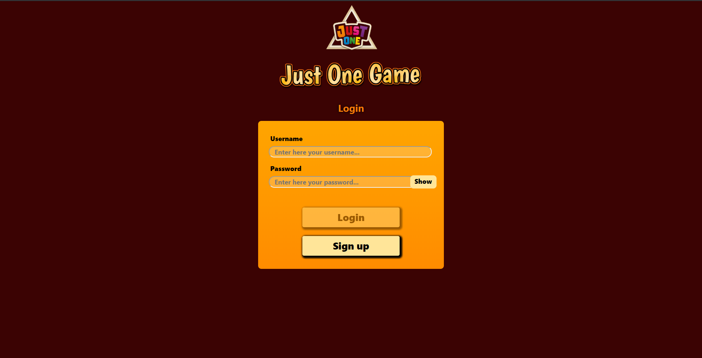
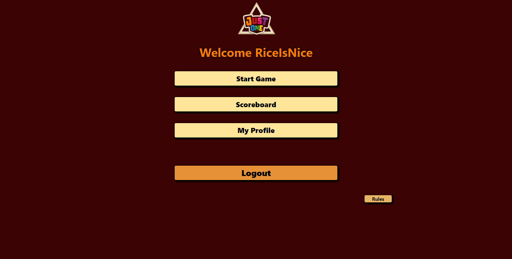
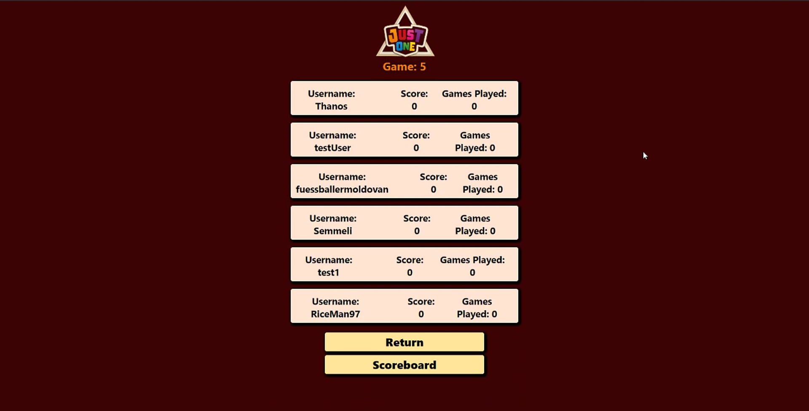
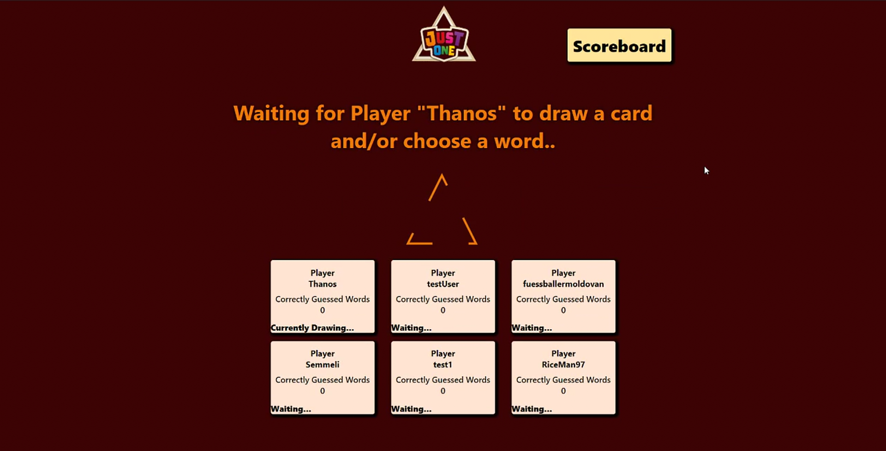

# SoPra FS20 - Group 11 - Just One (Client)

## Introduction

The game “Just One” is developed in accordance with the game’s rules, as a web application. It will have the following features:

- Users can create accounts, which will be visible to other users. They are also able to change their name and username.
- A global score system, where users can compare their score over time. It has a search function, wherein users are able to find each other via username.
- The 550 words from the original game are randomly assigned to a card whenever a new game is created. That way, the game offers more variety and new words can smoothly be added.
- A time tracker for certain user actions. Faster clue giving and guessing will increase the amount of points all of the users get at the end of the game. This amount will be individually modified by how many correct guesses and duplicate clues each user has submitted.
- Clues will, in a first step, be automatically checked by a language processing unit or clue checker. This is where the API service of Datamuse https://www.datamuse.com/api/ comes into play. The unit checks for multiple words, duplicates, singular/plural forms, stemming and homophones.

## Technologies

We used ReactJS to develop our game application.

Read and go through those Tutorials, It will make your life easier!

- Read the React [Docs](https://reactjs.org/docs/getting-started.html)
- Do this React [Getting Started](https://reactjs.org/tutorial/tutorial.html) Tutorial (it doesn’t assume any existing React knowledge)
- Get an Understanding of [CSS](http://localhost:3000) and [HTML](https://www.w3schools.com/html/html_intro.asp)!

Once you have done all of this, in the template there are two main external dependencies that you should look at:

- [styled-components](https://www.styled-components.com/docs)
  It removes the mapping between components and styles (i.e. external css files). This means that when you're defining your styles, you're actually creating a normal React component, that has your styles attached to it
* [react-router-dom](https://reacttraining.com/react-router/web/guides/quick-start) Declarative routing for React being a collection of navigational components that compose declaratively with your application. 

<!-- ## IDE Recommendation
As a student, you have the possibility with [JetBrains](https://www.jetbrains.com/student/) to obtain a free individual license and have access to several IDEs. 
We recommend you to use [WebStorm](https://www.jetbrains.com/webstorm/specials/webstorm/webstorm.html?gclid=EAIaIQobChMIyPOj5f723wIVqRXTCh3SKwtYEAAYASAAEgLtMvD_BwE&gclsrc=aw.ds) for your front-end. 
Once you have downloaded and installed it, you can add the following WebStorm plugins: 
> Go to Preferences > Plugins > Browse Repositories and look for: 
* [styled-components](https://plugins.jetbrains.com/plugin/9997-styled-components) (provides coding assistance like CSS Highlighting for Styled Components)
* [prettier](https://plugins.jetbrains.com/plugin/10456-prettier) (a smart code formatter)
* [Material Theme UI](https://plugins.jetbrains.com/plugin/8006-material-theme-ui) (Material Theme for Jetbrains IDEs, allowing a total customization of the IDE including Themes, Color Schemes, Icons and many other features.)

Feel free to use other IDEs (e.g. [VisualStudio](https://code.visualstudio.com/)) if you want.  -->
## High-Level Components

### Login
The first high level component of our game would be the login component, coded in file Login.js. Before a user can enter any site of this app, the login screen is rendered first to identify a user.

https://github.com/SoPra-FS20-Group11/sopra-fs20-group11-justone-client/blob/master/src/components/login/Login.js

### Mainscreen
A second high level component of the project on client side is the main screen of the app. The main file of this component is MainScreen.js. This file renders the first screen a user can see after logging in. The screen includes buttons that redirect to the game lobbies, a scoreboard, a user’s own profile and a logout button. There is also a popup for the game rules.

https://github.com/SoPra-FS20-Group11/sopra-fs20-group11-justone-client/tree/master/src/components/mainscreen

### Scoreboard
Thirdly, this project includes a Scoreboard.js file, where a scoreboard page is rendered. On this page, users can see all users of the app and what their all time scores are. By clicking on a user, it redirects to the user's profile page.

https://github.com/SoPra-FS20-Group11/sopra-fs20-group11-justone-client/blob/master/src/components/scoreboard/Scoreboard.js

### Game Lobby
The game lobby is an important component of this project. The file GameLobby.js renders all currently created games a user can join at this moment in time and a return button. When clicking on a game, it redirects to a Pregame-Screen of the clicked game. 

https://github.com/SoPra-FS20-Group11/sopra-fs20-group11-justone-client/blob/master/src/components/game/GameLobby.js

### Game
Lastly, the most important component of the app is the game itself. Since the game works by redirecting to twelve different screens throughout a running game, there is not a single main file for this component. The component is defined by all the files in the package /game except from the files {GameLobby.js, StartGame.js}.

https://github.com/SoPra-FS20-Group11/sopra-fs20-group11-justone-client/tree/master/src/components/game
This component renders all game screens and navigates a user through these game screens of this web-based application game of Just One.

## Launch and Deployment

We used an IDE called [Visual Studio Code](https://code.visualstudio.com/) to develop our project and add further functionality. 
In order to make it all work, cloning the server is also a necessity. It needs to be run in a separate IDE, in our project we used [IntelliJ](https://www.jetbrains.com/idea/).
Before running the npm commands (listed further below) with a terminal of your choice, you will need to head to the directory to which you cloned the client code.
Changing code within the IDE and then saving it, will immediately affect your local client. So, you won’t have to wait to see what your changes actually do.

### Prerequisites and Installation

For your local development environment you'll need Node.js >= 8.10. You can download it [here](https://nodejs.org). All other dependencies including React get installed with:

#### `npm install`

This has to be done before starting the application for the first time (only once).

#### `npm run dev`

Runs the app in the development mode. 
Open [http://localhost:3000](http://localhost:3000) to view it in the browser.

The page will reload if you make edits. 
You will also see any lint errors in the console (use Google Chrome!).

#### `npm run test`

Launches the test runner in the interactive watch mode. 
See the section about [running tests](https://facebook.github.io/create-react-app/docs/running-tests) for more information.

#### `npm run build`

Builds the app for production to the `build` folder. 
It correctly bundles React in production mode and optimizes the build for the best performance.

The build is minified and the filenames include the hashes. 
Your app is ready to be deployed!

See the section about [deployment](https://facebook.github.io/create-react-app/docs/deployment) for more information.

## Illustrations

- After running the client, you will be immediately represented with the login screen. From here on you can reach the signup screen or enter your info, to be redirected to the actual game.

- When you have logged in, you can either create/join a lobby, view player stats on the scoreboard, look at your own stats or have a quick read through the actual game’s rules. Of course there is the possibility to log out.

- After creating a game, other people will be able to join you and only the host may start the game. The game itself is straightforward and just as written in the rules.

- The only thing to consider is that we are using separate pages for each aspect of the game (e.g., drawing a card, giving clues, making a guess,...).

## Roadmap

The following features and design are always welcome as additions to our project: 
  - Sound effects or music during the game
  - Chat feature
  - Profile pictures
  - Sending invitations to join a game
  - Bots
  - A better solution for refreshing windows
  - Improvements on animations

## Authors and acknowledgment
Authors:
Marino Schneider, Md Rezuanual Haque, Michael Brülisauer, Patrick Reich, Vichhay Ok, Venusan Velrajah

Supervisor:
Alina Marti

## License

MIT License

Copyright (c) 2020 SoPra-Group-11

Permission is hereby granted, free of charge, to any person obtaining a copy
of this software and associated documentation files (the "Software"), to deal
in the Software without restriction, including without limitation the rights
to use, copy, modify, merge, publish, distribute, sublicense, and/or sell
copies of the Software, and to permit persons to whom the Software is
furnished to do so, subject to the following conditions:

The above copyright notice and this permission notice shall be included in all
copies or substantial portions of the Software.

THE SOFTWARE IS PROVIDED "AS IS", WITHOUT WARRANTY OF ANY KIND, EXPRESS OR
IMPLIED, INCLUDING BUT NOT LIMITED TO THE WARRANTIES OF MERCHANTABILITY,
FITNESS FOR A PARTICULAR PURPOSE AND NONINFRINGEMENT. IN NO EVENT SHALL THE
AUTHORS OR COPYRIGHT HOLDERS BE LIABLE FOR ANY CLAIM, DAMAGES OR OTHER
LIABILITY, WHETHER IN AN ACTION OF CONTRACT, TORT OR OTHERWISE, ARISING FROM,
OUT OF OR IN CONNECTION WITH THE SOFTWARE OR THE USE OR OTHER DEALINGS IN THE
SOFTWARE.
